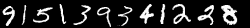
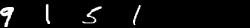

# A programe for generating images of sequence of numbers

A program that can generate images representing sequences of numbers, for data augmentation purposes. The user can specify the sequence of digits in the image, the minimum and maximum space between consecutive digits and the
width of the final image.

## Outline

These instructions will explain how to run the script in the command line and in a python console. 

### Package dependencies

- mnist '0.2.1'
- numpy '1.13.3'
- skimage '0.13.0'
- scipy '0.19.0'

### Running the script

#### Command line

The script generates an image and saves it in the current directory as a 'generated_image.png'

Parameters:

- sequence: list, the sequence of digits to be generated
- min_spacing: int, minimum spacing between consecutive digits in pixels
- max_spacing: int, maximum spacing between consecutive digits in pixels
- image_width: int, width of the generated image in pixels

Command line:
```sh
$ python script.py sequence min_spacing max_spacing image_width
```

Example:

```sh
$ python script.py [9,1,5,1,3,9,3,4,1,2,2,8] 5 7 250
```

Image output:




#### Python Console

The `generate_numbers_sequence()` method returns an image as a `numpy.ndarray` containing the sequence
of the numbers.

Parameters:

- digits: list, the sequence of digits to be generated
- spacing_range: tuple, the minimum and the maximum spacing between consecutive numbers in pixels
- image_width: int, width of the generated image in pixels


Input example:

```
from script import generate_numbers_sequence
generate_numbers_sequence(digits=[9, 1, 5, 1], spacing_range=(1, 3), image_width=400)
````


Output:

```
array([[ 0.,  0.,  0., ...,  0.,  0.,  0.],
       [ 0.,  0.,  0., ...,  0.,  0.,  0.],
       [ 0.,  0.,  0., ...,  0.,  0.,  0.],
       ..., 
       [ 0.,  0.,  0., ...,  0.,  0.,  0.],
       [ 0.,  0.,  0., ...,  0.,  0.,  0.],
       [ 0.,  0.,  0., ...,  0.,  0.,  0.]], dtype=float32)
```

### Implementation details

- Main goals achieved:
    - Generated images the same size as specified each time
    - Accurate spacing between digits in the image
        - Achieved by cropping horizontally
        - The space between the digits represents the horizontal space between the vertical
        endpoints of each digit, i.e., the last column when at least one pixel of an image of a digit is not equal
         zero followed by a column with all zeros. 
        - If images were not cropped, the `spacing_range` parameter would become meaningless, since it would not actually
    determine the real gap between digits, but only the gap between the images of each digit
    - Digits's shape does not change (aspect ratio remain same)
        - Achieved by avoiding any resizing horizontally, since height of images is fixed
    
- Potential issues:
    - Cropping each image horizontally creates ambiguity to whether all digits will fit in the final image:
        - Before actually cropping an image of a digit, we are not able to know what the size of
         the image of the digit will be after cropping
    - Empty space on the right hand side in the image when the digits and space between digits do not fill 
    the specified width of the image. For example:
    
    

- Potential improvement:
    - Crop on the y-axis as well and resize the image as much as possible whilst keeping the aspect ratio the same

- Note:
    - Space between individual digits in the generated image is sampled from the uniform
      distribution with range specified by the user. The space between
      the digits is not fixed, since it is sampled individually from the uniform distribution for 
      each space.


##### Further notes on cropping

- Each digit is cropped horizontally such that only the number stays in the image
    - Almost all images in the MNIST dataset have various sizes of space between the digit and the sides of the image
    - An error is raised if digits do not fit in the image, once all digits had been cropped 
    and the space between the digits was generated
    - Initially, resizing images after cropping was considered. However, resizing an image horizontally when the
     vertical size is fixed changes the shape of the digit and deteriorates the interpretability of the actual digit.
    - Note that cropping is implemented by removing all columns which have all pixels black
        - This might potentially delete a column in the middle of an image if there is gap (however, very unlikely)

    
### Testing

#### Setup

- Tests written using the ```pytest``` '3.0.7' framework
    - Install as ```pip install -U pytest```

- Test can be run from the command line as following:

```sh
$ pytest
```
  
- Code coverage tested using ```pytest-cov``` '2.5.1' plugin
    - Install as ```pip install pytest-cov```

- Code coverage can be run from the command line as following:

```sh
$ py.test --cov-report term-missing --cov
```


#### Results

- Tests cover testing that:
    - all possible types of user input for each parameter
    - correct digits were selected from the MNIST dataset 
    - all digits corresponding to a given label were selected from MNIST dataset
    - image height was not adjusted at any stage
    - outputs of each method are sensible (e.g., cropping does not output a larger image than its input)
    - outputs are of desired type (e.g., integer)
    - test space image is dark black
    - resulting width of image is correct
    - all selected digits fit in the image

- The following is the test result:

````
======================================================== 50 passed in 2.70 seconds =========================================================
robin123:Cogent Labs assignment robinhornak$ pytest
=========================================================== test session starts ============================================================
platform darwin -- Python 3.6.3, pytest-3.0.7, py-1.4.33, pluggy-0.4.0
rootdir: /Users/robinhornak/Cogent Labs assignment, inifile:
plugins: cov-2.5.1
collected 50 items 

tests/test_crop_image.py ..
tests/test_generate_black_space_fill.py ...
tests/test_generate_final_image.py ..
tests/test_generate_numbers_sequence.py ...
tests/test_get_indexes_digits.py ....
tests/test_get_space_between_digits.py ..
tests/test_select_images_for_digits.py ....
tests/test_check_valid_inputs/test_digits_input.py ..........
tests/test_check_valid_inputs/test_image_width_input.py .......
tests/test_check_valid_inputs/test_spacing_range_input.py .............

======================================================== 50 passed in 3.11 seconds =========================================================
````

- The following is the coverage report:

```sh
---------- coverage: platform darwin, python 3.6.3-final-0 -----------
Name                                                        Stmts   Miss  Cover   Missing
-----------------------------------------------------------------------------------------
script.py                                                      95      3    97%   295-298
tests/__init__.py                                               0      0   100%
tests/test_check_valid_inputs/__init__.py                       0      0   100%
tests/test_check_valid_inputs/test_digits_input.py             17      0   100%
tests/test_check_valid_inputs/test_image_width_input.py        13      0   100%
tests/test_check_valid_inputs/test_spacing_range_input.py      31      0   100%
tests/test_crop_image.py                                       12      0   100%
tests/test_generate_black_space_fill.py                         9      0   100%
tests/test_generate_final_image.py                             12      0   100%
tests/test_generate_numbers_sequence.py                        15      0   100%
tests/test_get_indexes_digits.py                               24      0   100%
tests/test_get_space_between_digits.py                          9      0   100%
tests/test_select_images_for_digits.py                         15      0   100%
-----------------------------------------------------------------------------------------
TOTAL                                                         252      3    99%
```

#### Limitations


- The returned image was only tested for size and type (np.ndarray), however it was not tested whether the resulting 
array contains the correct sequence of digits 

- Command line input was not tested